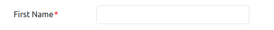

The appearance and behaviour of the comparative judgement software can be changed in several ways. This includes
the option to change all text that appears on the website including the labels on the buttons, allowing the
interface to appear in languages other than English (the default). There are two levels of configuration files, the
first is the language file and the second is the project file. In order to keep the project file small the language
file contains all of the strings that are less likely to need changing if the interface will be in English.
The project configuration file controls the behaviour of the interface and sets the strings that are more likely to change
from project to project. Any of the strings from the language configuration can be added to the project file if you
want to change them for a project without changing the language file itself, they can also be changed in the language file.
For the purposes of validation the language and project configuration files are merged ensuring that the required data
are available in at least one of the files.

Details of the images to be used can either be provided in the project configuration or, with the exception of the
weighted pairs option, in a csv file. 

Up to three additional pages can be included in the interface. There are three
ways each of these pages can be created: as a published google document; a full HTML file (for example a word file
saved as HTML); as a fragment of HTML code.

## Images

The images to be used for the comparisons need to be put in the `comparison_interface/static/images` folder.

The images must meet the following criteria:

+ format png or jpg/jpeg files
+ minimum pixel size 300x300
+ unique file names

## Language Configuration

All the the text that a user sees on the website can be configured. Any strings which are language rather than project specific are stored in the language file in the languages directory. The sample file is `en.json` and contains all of the non project specific strings in English. This file is a JSON file and can be copied and edited to be used for other languages. All of the keys in the JSON should be present for any additional languages generated and the ISO code for the language used to name the file for example `en.json` or `de.json`. Any string can actually be used for the file name as long as that same string is used in the language setting described below but using the iso code will help others understand the system.

To tell the system which file to use, change the setting in the `flask.py` file in the `configuration` directory. The configuration for English is as follows:

```python
    LANGUAGE = 'en'
```

This will look for the display strings in `languages/en.json`.

If the language strings do need to be changed for a specific project, then any of the keys in the language file can be included in the project configuration file and these will be displayed instead of the strings set in the language file.

## Project Configuration

The project configuration file is written in JSON and has four sections.

1. **behaviourConfiguration** defines the settings to control the behaviour of the system including what links are present in the header
1. **userFieldsConfiguration** details the questions that the user is asked on the registration page
1. **websiteTextConfiguration** defines the text that the user sees on the website
1. **comparisonConfiguration** describes the images being used for the project and how they should be selected for comparison

When the system is started the configuration file requested will be validated and if there are any problems with the file the error message should help to fix them.

The easiest way to create a configuration file is to start with one of the existing examples and modify it to meet the requirements of the project. Each of the sections will be covered below.

**Note**: If the configuration file is edited while the system is running then the system will have to be reset and all
data in the database will be deleted. Once a system is running do not change a configuration file unless you want to reset the database.

### Behaviour configuration

This section controls aspects of how the system works.

The **exportPathLocation** is required and determines where exported data files are saved when the database is exported.

There is also a required boolean key **renderCookieBanner**, which determines whether the user is asked to accept the website cookies when first opening the website. The title and text for the cookie banner is stored in the language file but it you want to customise it for a particular project then the **siteCookiesTitle** and **siteCookiesText** keys can be added to the project configuration with the strings you want to display.

There are also three booleans which are required to determine which additional pages to include. The configuration of
these pages is covered in the [Additional pages](#additional-pages) sub-section.

Five further boolean keys are required.

**renderUserItemPreferencePage** determines if the user is asked to specify whether they know each item in the set of items to be judged. For large item sets it is probably best to determine a users knowledge based on groups rather than individual items and set this value to false. However, it can be used in combination with the group preferences to add an extra level of selection if required. For weighted item configurations this boolean should be set to false.

**allowTies** determines whether or not the system allows a user to select both images and record a tied result. Set this to true if you want to include ties in your study and to false if you do not.

**allowSkip** determines whether or not the system allows a user to skip a comparison.

**allowBack** determines whether or not the system allows a user to go back and check or change a previously made judgement.

**offerEscapeRouteBetweenCycles** determines whether a user can continue making judgements indefinitely or if they are offered an opportunity to either logout or continue making judgements after reaching a target number. If this is set to true then two further keys are required. **cycleLength** specifies how many comparisons should be made in each cycle and **maximumCyclesPerUser** determines how many cycles each user is permitted to complete before no more comparisons will be presented to them.

#### Additional pages

Three required boolean values in the behaviour configuration section determine which links appear in the header of the webpage. If any of these booleans are set to true either the corresponding html key is required. There are two options for providing the HTML. If you can write your own HTML then you can provide a fragment of HTML rather than a whole page. The fragment should be wrapped in a `<div>` and contain the HTML you want to be displayed in the template. If you can't write your own HTML then you can create a word document and save it as 'web page, filtered' with the `.html` suffix. In both cases the template will take care of the header itself, the HTML just needs to contain the content you want to display. If you choose one of the HTML options then the html key should be used to give the path to the HTML file. If ensuring that the website is accessible is important to you then the best option would be to write your own HTML fragment and make sure that it follows the WCAG guidelines.

The keys and their corresponding link/html keys are listed below.

+ **renderUserInstructionPage** [boolean]
  + **userInstructionHtml** [filepath]
+ **renderEthicsAgreementPage** [boolean]
  + **userEthicsAgreementHtml** [filepath]
+ **renderSitePoliciesPage** [boolean]
  + **sitePoliciesHtml** [filepath]


### User fields configuration

This section configures all of the questions that the user is asked when registering on the system with the exception of the ethics agreement statement, this is configured in the behaviour section.

If no user registration questions are required then the userFieldsConfiguration can just be an empty list as follows:

```json
{
  "userFieldsConfiguration": []
}
```

If questions are required then the configuration for each question needs to be added to the list. Each question can be either required or optional. A user is not allowed to register until all required questions are answered. Some fields such as email and integer also have additional validation on the data supplied. If the data does not meet the criteria, such as an invalid email address, then an error message will display on the screen. With the exception for group select which is covered in the [website text configuration section](#website-text-configuration), these error messages are not configurable as they are messages generated automatically by the browser. They will appear in the language which the user has set as their preferred browser/system language.

The supported html widget types are:

+ text
+ int
+ radio
+ dropdown
+ email

For example, to add a single question which asks for the user's first name and which is required, use the following configuration.

```json
{
  "userFieldsConfiguration": [
    {
      "name": "name",
      "displayName": "First Name",
      "type": "text",
      "maxLimit": 250,
      "required": true
    },
  ]
}
```

This will be rendered on the page as follows.



Full configuration for each of these types is provided in all of the example files. These can be used as a basis to construct your own questions.

### Website text configuration

There are up to four compulsory keys (depending on the behaviour configuration) in the website text configuration. There is one optional field. In addition, any of the fields in the language configuration file can be added into this section to override the language defaults should this be required.

All project configurations require the **rankItemInstructionLabel** key which is the text that is presented to the user along with the two images used to make the judgement.

If the behaviour configuration **renderUserItemPreferencePage** is set to `true` then the **itemSelectionQuestionLabel** key is also required. This is the text presented to the user when they are selecting which items they know and will be followed by the image display name.

If multiple groups are defined in the comparison configuration section then the keys **userRegistrationGroupQuestionLabel** and **userRegistrationGroupSelectionErr** are required. The first is the text put alongside the group selection section on the registration page, the second is the error text displayed if no group has been selected and a user tries to register.

There is also an optional key for all projects **additionalRegistrationPageText** which instead of containing a string should contain a list of strings. These strings will be displayed on the registration page below any user questions and above the ethics approval statement (if used) and the registration button. This section can be used to display any required information to the user, the initial motivation for this section was to provide the relevant licensing information for all of the images used on the website. It can also be useful to display a welcome message to users if no questions are being asked and the registration screen is just used as a login screen.

### Comparison configuration

This section needs to define all of the images you want to use organised by groups and for weighted item pairs all of the pairs and their associated weights. If you are not using weighted pairs this comparison configuration can be provided directly in the JSON or as a csv file. When using a csv file the csv file and the JSON configuration file should be put in the same directory and when running the setup and reset commands the path to the configuration file should instead be to the parent directory containing the two files.

To see how the JSON should be configured please refer to the examples provided.

Refer to `examples/config-equal-item-weights.json` or `examples/config-equal-item-weights-preference.json` to configure a scenario without any weighting for the item pairs and either with or without the item preference stage.

Refer to `examples/config-custom-item-weights.json` to configure a scenario where custom weights will be defined for all item pairs.

If the image configuration is being provided in a csv file, then the JSON file must provide the name of the csv file as follows:

```json
"comparisonConfiguration" : {
        "csvFile": "image-data.csv"
    }
```

The csv file must contain a minimum of two columns and up to five columns. The column headers and their content are listed below. The order of the column is not important but the header names are: case is not relevant but the correct wording and spacing must be followed.

+ **image** - *required* - The file name of the image.
+ **item display name** - *required* - The string to be used to describe the image in the interface.
+ **item name** - *optional* - A string which identifies the image and only contains lowercase alpha numeric characters, underscores and dashes. This will be generated from the item display name if the column is not provided, but if there are any characters (with the exception of spaces) in the item display name column then validation errors will be raised.
+ **group display name** - *optional* - A string that identifies the group that this image belongs to. If this column is not provided then all of the images will be added to the single default group.
+ **group name** - *optional* - As with the item name this will be automatically generated from the group display name if that column is provided but if validation errors are raised due to special characters then this column may also be required.

An example of a configuration using a csv file can be found in ```examples/csv_example```.

## Troubleshooting

1. The configuration file requires a specific format. Try to follow one of the examples supplied with this project to avoid problems.
1. When running the `setup` command, the software validates the format of the configuration file, and if used the csv file. The messages will help you to find any problems with the file.
1. If you get the error **RuntimeError: Application unhealthy state. Please contact the website administrator.**. This means that the website configuration file was modified after the website setup was executed. To fix this problem, run the `reset` command.

## Summary

1. Replace the images in `comparison_interface/static/images` with your own images
1. Change any settings that need changing in the `flask.py` file and set your own secret key
1. Change any strings required in the `en.json` file or supply your own language file
1. Add your own configuration file(s) to a directory within the `comparison_interface` directory
1. Run the following commands

    ``bash
    flask --debug setup [path_to_configuration_file_or_directory_if_using_a_csv_file]
    flask --debug run --port=5001
    ```
1. Navigate in your preferred browser to <http://localhost:5001>
