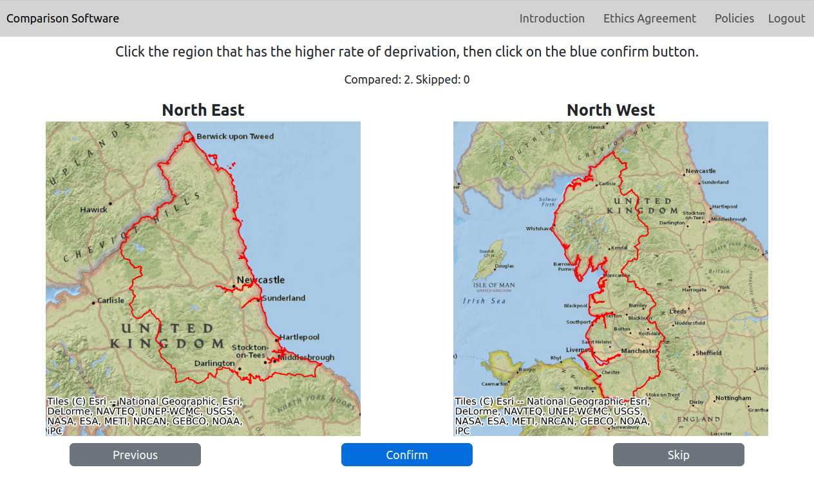

# Summary

Comparative judgement is a research method which asks participants (refered to as judges) to make pairwise judgements of items based on a given criteria, for example which of two areas has the higher rate of deprivation, or which of two student assignments show a better understanding of a particular topic. These pairwise judgements can then be used to rank all the items in the study based on the creiteria. Pairwise judgements have been shown to be easier for people to make than alternatives such as making a absolute judgement based on a scale or putting a whole series of items in order based on a criteria [@Jones2023]. These models are gaining popularity in social sciences but the options for data collection remain limited. The comparison-interface is a Flask app that provides a specialist interface for comparative judgement which is domain agnostic and highly configurable in terms of its behaviour and the text presented to the user. This means that the same code can be configured to collect comparative judgement data on different topics using different languages making it applicable to a wide range of research projects. The website complies with WCAG 2.2 level AA and works on smaller screens such as phones and tablets as well as larger screens. It can be configured without any programming knowledge using JSON, or a combination of JSON and a CSV file. Any set of images can be used in the app. All of the data collected is stored in a SQLite3 database and an export to CSV files is provided. Example configurations are provided as a starting point for users. The interface has been used to collect data for a number of studies, for example [@Seymour2022; @Seymour2024; @Seymour2025] and has now been dployed in partnership with seven councils and local authorities in the UK. 

# Statement of Need

Mainstream survey collection applications, such as KoBo Toolbox or Online Surveys, do not currently allow for comparative judgement questions to be included in surveys. This limits the application of comparative judgement in the social sciences. We are only aware of two packages that do provide data collection software, both of which are for specific contexts. The open source python package PsychoPy [@Peirce2019] can be used to run comparative judgement studies for experimental psychology studies. This software is not specific to comparative judgement and allows a lot of different types of studies to be created. While this is an advantage for research that needs to combined different techniques, it makes setting up a comparative judgement study more complex. The PsychoPy package is also aimed at academics and researchers in experimental psychology. Outside of academia, NoMoreMarking [@Jones2015] provide proprietary but free to use software that is designed for schools and other education providers to run studies about student assessment. While custom studies can be created the system to design these is tailored to the education context and is not applicable to all comparative judgement studies. For example, to track user engagement, each judge needs to be sent the url and register with their email address. This makes it unsuitable for open or anonymous studies. We required an app that was flexible in terms of the items thast could be compared and the wording for the research question.Our comparison-interface app aims to make comparative judgement studies simpler, more efficient and more attractive to run across a wide range of disciplines.

Current comparative judgement data collection software implements standard experimental designs, limiting the way in which surveys can be run. Our app allows for three types of experimental design confirguartion. The first is to split the study items into multiple groups and ask the judges which groups they are familair with. This makes the data collection process more efficient that asking judges to comapre objects they are not familiar with, which can increase survey fatigue. The second is allowing the probability different items are compared against each other to be customised. The default option is to chose objects to compare against each other uniformly at random from the list of all possible pairs, but we also allow probabilities to be specificied for each pair, allowing some pairs to be featured more frequently than others. The third is that we allow for comaprisons to be tied. This can be useful in studies where there are several items that are difficult to distinguish between. 

# Configuration Summary

The full list configuration options are explained in our documentation. The app includes the option to configure all of the text that the judge sees on the webpage which means that the system can be configured to work with any language, defaults are provided in English for all text strings. Some of the behaviour of the website can also be tailored to the requirements and experimental design of the study. This includes the ethics and legal information shown the the judges, as well as the experimental design features outlined in the Statement of Need. 

 { width=80% }

# Acknowledgements and Funding

This work was supported by a UKRI Future Leaders Fellowship [MR/X034992/1].

# References
